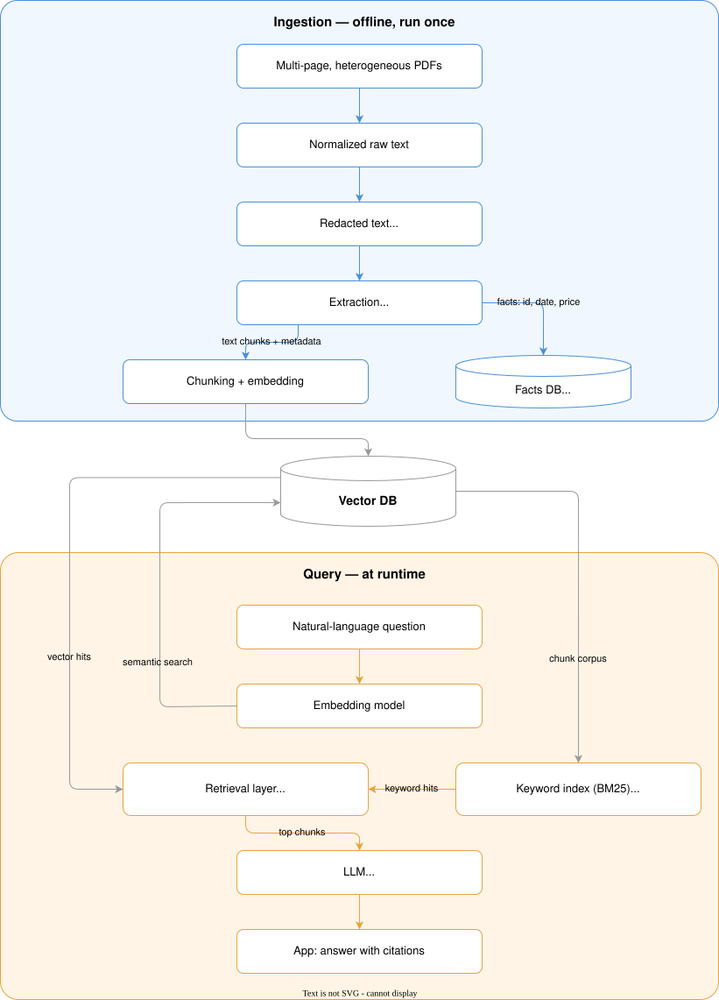
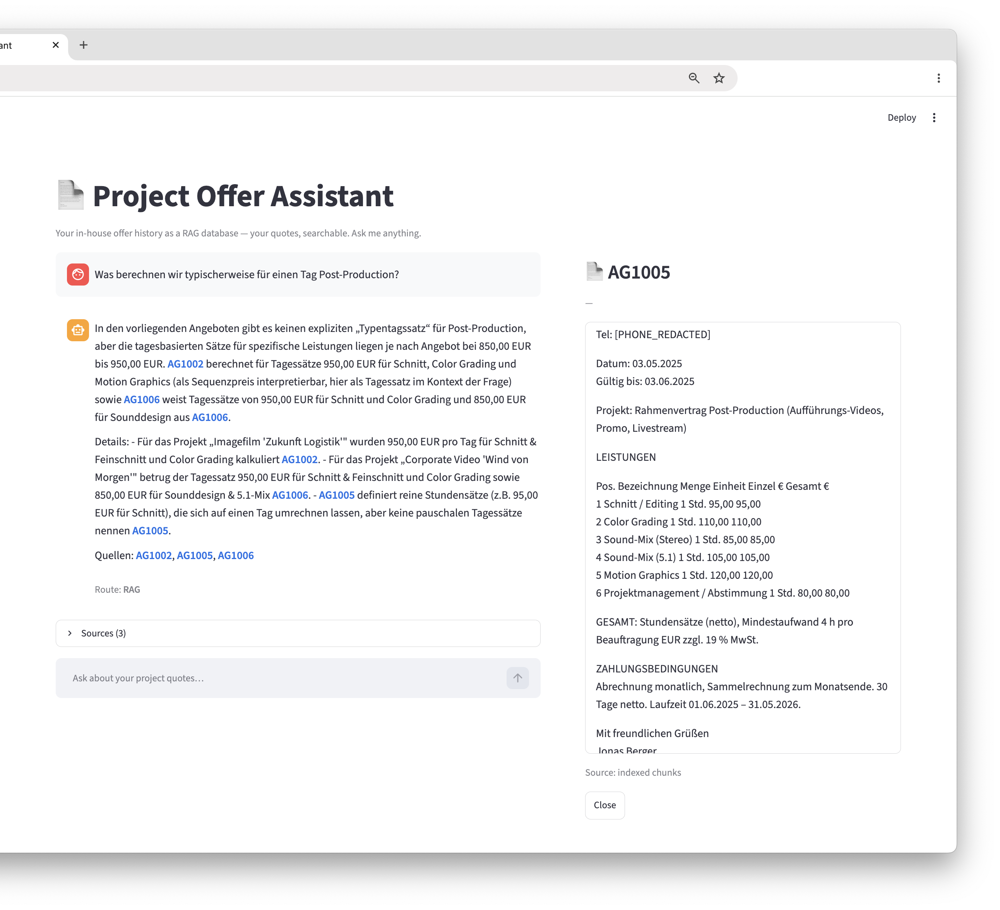

# Project Offer Assistant

*Your in-house offer history as a RAG database — for project-based service providers.*

## Mission

The Project Offer Assistant turns a growing pile of past project offers into a
searchable, self-hosted knowledge base.

It ingests multiple offer documents — heterogeneous PDFs of 1–5 pages each,
with no uniform structure — and turns them into a structured RAG database that
you can query in natural language.

The focus is on the context around the numbers: **framework conditions,
timelines, and line items** — how similar projects were scoped, what was
included, under which terms.

It is **not a price calculator**. For vague inquiries it answers the question
that actually matters in the first call: *"where do we end up?"* — an
orientation based on what similar projects looked like before.

Everything runs in-house: no cloud APIs, no per-token costs, full data privacy.

## Repository Layout

```
app/
├── streamlit_app.py        thin UI layer (chat, citations, status)
├── src/rag_system/         RAG logic (testable without the UI)
│   ├── config.py           settings from .env (3-layer env loading)
│   ├── retriever.py        ChromaDB vector retrieval + BM25 + RRF fusion
│   ├── llm.py              answer generation (OpenAI-compatible endpoint)
│   ├── query.py            question routing, prechecks, refusal gate
│   ├── query_expansion.py  query expansion (abbreviations, synonyms)
│   ├── breadth.py          breadth routes (statistics, comparison, draft, year)
│   └── citation_markup.py  citation markup → markdown/HTML rendering
├── scripts/build_index.py  (re)build the vector index from data/
├── tests/                  pytest suite (92 tests)
└── Makefile                install / index / run / test targets
notebooks/                  offer pipeline (PDF → sanitize → extract → index → demo)
source/offers/              fictitious sample offers + generator
scripts/                    pipeline scripts (sanitizer.py, requirements.txt)
data/                       pipeline data (redacted/ + extracted/ committed, raw/ + db/ ignored)
docs/                       sidequest documentation (e.g. vLLM setup)
.env.example                default configuration (committed)
.env                        local overrides (git-ignored)
```

**Build-once, reload-later:** the vector index is built once by the pipeline
notebooks (persisted to `data/db/chroma/`) and the app only reloads it via
`INDEX_DIR` in `.env` — never re-embeds at query time.

## Prerequisites

| Requirement | Version / Notes |
|---|---|
| Python | 3.11 (tested with 3.11.15) |
| conda (or any env manager) | `conda create -n quote-rag python=3.11` |
| Ollama | local, for embeddings (`nomic-embed-text`) — CPU is fine |
| LLM endpoint | any OpenAI-compatible API: vLLM on a GPU machine (see [`docs/`](docs/OVERVIEW.md)) or Ollama local |
| OS | macOS / Linux (developed on macOS) |

No cloud accounts, no paid APIs. Everything runs on your own hardware / LAN.

## Setup

```bash
# 1. Create the environment
conda create -n quote-rag python=3.11 -y
conda activate quote-rag

# 2. Install dependencies
make -C app install           # = pip install -r scripts/requirements.txt

# 3. Configure
cp .env.example .env          # then edit endpoints / model names

# 4. Put secrets OUTSIDE the workspace (highest-priority env layer):
mkdir -p ~/.config/rag-quote-history
printf 'LLM_API_KEY=your-key\n' > ~/.config/rag-quote-history/secrets.env
chmod 600 ~/.config/rag-quote-history/secrets.env
```

### Configuration (3-layer env loading)

Both the app (`app/src/rag_system/config.py`) and the notebook setup cells
load configuration in this order (later layers win):

1. `.env.example` — committed defaults
2. `.env` — local overrides (git-ignored)
3. `~/.config/rag-quote-history/secrets.env` — **secrets only** (API keys),
   outside the workspace, `chmod 600`. External agents with repo access
   never see the real key.

All pipeline parameters (chunking, RRF weights, HyDE, refusal thresholds,
…) are env-driven — see `.env.example` for the full list with comments.

## Pipeline

The offer pipeline (PDF → sanitize → extract → index → retrieval demo) lives
at the repository root: `notebooks/`, `source/offers/`, `scripts/`,
`data/`. See [`notebooks/PIPELINE.md`](notebooks/PIPELINE.md) for the layout,
setup, and how to run the notebooks (01 → 05).

### Data journey



<em>Figure 1: The data journey — from offer PDF to cited answer. Ingestion runs once (offline); the query path runs at runtime.</em>

Two things worth noting:

- **The keyword index does not exist on disk.** At query time the retrieval
  layer loads the chunk corpus from the vector DB and builds the BM25 keyword
  index on the fly — the vector DB is the single source of truth, so the
  keyword path can never drift out of sync with the vector path.
- **The embedding model serves the question, not the answer.** The question
  is embedded for the vector search; the LLM only ever sees the retrieved
  chunks and generates the cited answer from them.

| Component | Choice |
|---|---|
| LLM | Qwen 27B via vLLM (GPU) or Ollama (local) — OpenAI-compatible API |
| Embeddings | `nomic-embed-text` via Ollama (local, CPU) |
| Vector DB | ChromaDB, persistent on disk |
| Index pipeline | LlamaIndex (notebooks 01–03: chunking, documents, Chroma adapter) |
| App (RAG logic) | hand-rolled, stateless — ChromaDB + BM25/RRF fusion, no framework at runtime |
| Frontend | Streamlit |

**Design decision: no framework at runtime.** LlamaIndex is used only to
*build* the index (chunking, document model, Chroma adapter). The app itself
is a small, stateless RAG system written from scratch — retrieval
(ChromaDB + BM25 with RRF fusion), question routing, and answer generation
are plain Python with direct `chromadb` / `ollama` / OpenAI-compatible API
calls. This keeps the runtime dependency footprint small, avoids
framework lock-in, and makes every stage (router, fusion, refusal gate)
directly inspectable and testable. It is a deliberate choice that can be
revisited later — see [`docs/OVERVIEW.md`](docs/OVERVIEW.md) for the outlook.

## Usage

```bash
# build the vector index: run notebooks/ 01 → 03 (see notebooks/PIPELINE.md)
make -C app run               # start the app → http://localhost:8501
make -C app test              # run the test suite (92 tests)
```

### Screenshots

<!-- TODO: add screenshots here (chat with citations, comparison route,
     offer detail panel) — link them as:
     
-->


<em>Figure 2: The Project Offer Assistant in action — a natural-language question about day rates, answered with cited sources (right: the offer detail panel for the clicked citation AG1006).</em>

## Privacy

- Unredacted texts (`data/raw/`), the index (`data/db/`) and `.env` are
  git-ignored — real customer data never enters version control.
- `data/redacted/` and `data/extracted/` contain only fictitious sample data.
- API keys live in `~/.config/rag-quote-history/secrets.env` — outside the
  workspace, never committed.
- All inference runs locally / on your own LAN.