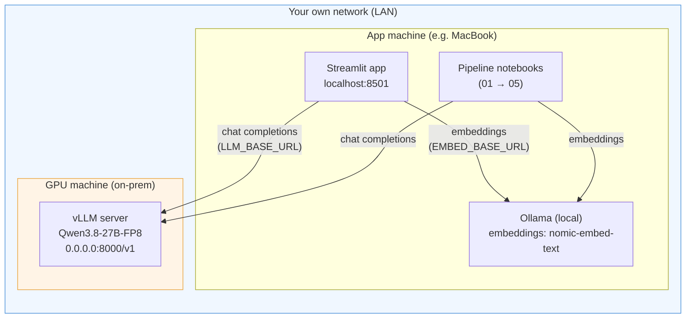
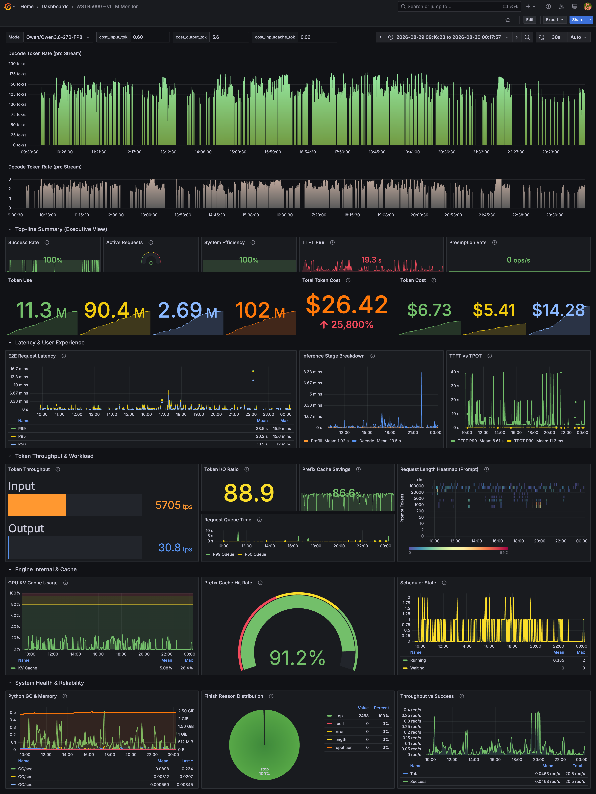
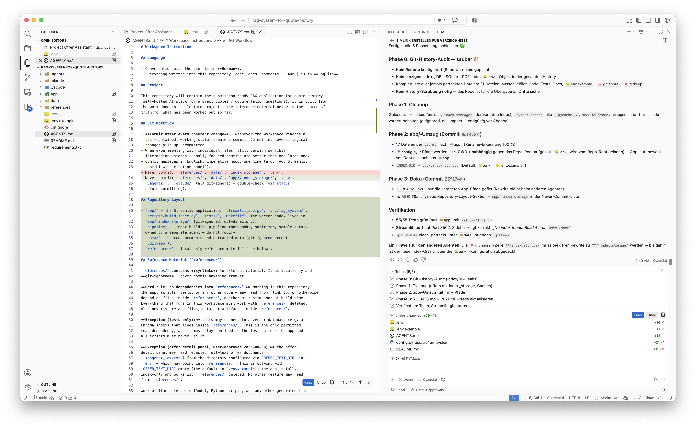

# Local Inference Setup (Sidequest)

How to run the LLM endpoint for the Project Offer Assistant with
self-hosted inference. The app and the notebooks only need an
**OpenAI-compatible API** — both vLLM (GPU) and Ollama (local) provide
one out of the box.

> **On-prem / own network:** everything runs inside **your own network**.
> The vLLM server runs on a GPU machine in the office; the app and the
> notebooks reach it over the LAN via its internal IP. No internet
> connection, no cloud, no external API — all prompts, offers and
> answers stay inside your network.

## How it fits together



- **LLM** (answer generation): vLLM on the GPU machine, reached via
  `LLM_BASE_URL=http://<gpu-host>:8000/v1` — `<gpu-host>` is the
  machine's **internal LAN IP** (e.g. `192.168.1.50`). The server binds
  to `0.0.0.0`, so every machine in your network can reach it. No port
  forwarding, no public IP, no TLS needed on a trusted LAN.
- **Embeddings** (indexing + retrieval): Ollama on the app machine
  itself — CPU is fine, nothing leaves the machine.
- **Vector index** (ChromaDB): local disk, `data/db/chroma/`.

## Option A: vLLM on a GPU machine (recommended)

### What you need

| Requirement | Notes |
|---|---|
| GPU machine | 2× NVIDIA GPU (tensor parallelism) for a 27B model |
| CUDA + drivers | matching the vLLM build |
| vLLM | installed in a dedicated venv (example below uses `/opt/vllm`) |
| Model weights | `Qwen/Qwen3.8-27B-FP8` (Hugging Face) |

### Quick start (CLI)

```bash
vllm serve Qwen/Qwen3.8-27B-FP8 \
    --served-model-name qwen3.8:27b \
    --tensor-parallel-size 2 \
    --max-model-len 262144 \
    --host 0.0.0.0 --port 8000
```

The server exposes the OpenAI API under `/v1`:

```
GET  /v1/models
POST /v1/chat/completions
```

### Production: systemd service

`/etc/systemd/system/vllm.service`:

```ini
[Unit]
Description=vLLM Inference Server
After=network-online.target
Wants=network-online.target
StartLimitBurst=3
StartLimitIntervalSec=300

[Service]
User=<your-user>
Environment="CUDA_HOME=/opt/vllm/lib/python3.12/site-packages/nvidia/cu13"
Environment="PATH=/opt/vllm/bin:/opt/vllm/lib/python3.12/site-packages/nvidia/cu13/bin:/usr/local/sbin:/usr/local/bin:/usr/sbin:/usr/bin"
EnvironmentFile=/etc/vllm/env
Environment="VLLM_USE_FLASHINFER_SAMPLER=0"
Environment="PYTORCH_CUDA_ALLOC_CONF=expandable_segments:True"
ExecStart=/opt/vllm/bin/vllm serve Qwen/Qwen3.8-27B-FP8 \
  --served-model-name Qwen/Qwen3.8-27B-FP8 qwen3.8:27b qwen3.8 \
  --tensor-parallel-size 2 \
  --max-model-len 262144 \
  --reasoning-parser qwen3 \
  --enable-auto-tool-choice \
  --tool-call-parser qwen3_coder \
  --default-chat-template-kwargs '{"reasoning_effort": "medium"}' \
  --override-generation-config '{"temperature": 1.0, "top_p": 0.95, "top_k": 20, "min_p": 0.0, "presence_penalty": 0.0, "repetition_penalty": 0.0}' \
  --enable-prefix-caching \
  --enable-prompt-tokens-details \
  --enable-chunked-prefill \
  --max-num-batched-tokens 16384 \
  --kv-cache-dtype fp8 \
  --speculative-config '{"method":"mtp","num_speculative_tokens":3,"draft_tensor_parallel_size":1}' \
  --host 0.0.0.0 --port 8000
Restart=on-failure
RestartSec=30

[Install]
WantedBy=multi-user.target
```

Notes:

- `/etc/vllm/env` holds secrets (e.g. `HF_TOKEN=...`) — `chmod 600`,
  outside the repo.
- `/opt/vllm` is an example venv path — adjust `CUDA_HOME`, `PATH` and
  `ExecStart` to wherever your venv lives.
- Port `8000` is the vLLM default; change it if something else is using it.

```bash
sudo systemctl daemon-reload
sudo systemctl enable --now vllm
journalctl -u vllm -f        # watch startup
```

### Key flags (what actually matters)

| Flag | Why |
|---|---|
| `--kv-cache-dtype fp8` | **Game changer** — halves KV-cache memory, so much longer context fits on the same GPUs |
| `--speculative-config` (MTP) | **Big speedup** — the model's own multi-token-prediction head drafts 3 tokens per step, verified by the full model |
| `--default-chat-template-kwargs '{"reasoning_effort": "medium"}'` | Qwen3 thinking mode is on by default; capping the effort keeps RAG answers from burning tokens on internal reasoning |
| `--override-generation-config` | Pins sampling params (temperature 1.0, top_p 0.95, top_k 20) so individual clients cannot drift them |
| `--enable-chunked-prefill` | Splits long prompts into chunks — smoother batching and lower time-to-first-token under load |
| `--enable-prefix-caching` | Reuses KV cache for shared prompt prefixes (our system prompt is constant across requests) |
| `--reasoning-parser qwen3` | Splits reasoning content into a separate field in the API response |
| `--max-num-batched-tokens 16384` | Batch token budget — not critical, leave at default if unsure |

## Option B: Ollama (no GPU)

For local development without a GPU machine, Ollama serves the same
OpenAI-compatible API:

```bash
ollama serve                      # default: http://localhost:11434
ollama pull qwen3.5:0.8b
ollama pull nomic-embed-text
```

```bash
# .env
LLM_BASE_URL=http://localhost:11434/v1
LLM_API_KEY=ollama                # any non-empty value
LLM_MODEL=qwen3.5:0.8b
EMBED_BASE_URL=http://localhost:11434
EMBED_MODEL=nomic-embed-text
```

## Wiring it into this repository

1. `.env` (local, git-ignored):

   ```bash
   LLM_BASE_URL=http://<gpu-host>:8000/v1
   LLM_MODEL=qwen3.8:27b
   ```

   `<gpu-host>` is the **internal LAN IP** of your GPU machine
   (e.g. `192.168.1.50`) — see the topology diagram above.

2. API key (if the server is behind auth) goes into the **secrets file**
   outside the workspace — never into `.env` or the repo:

   ```bash
   mkdir -p ~/.config/rag-quote-history
   printf 'LLM_API_KEY=your-key\n' > ~/.config/rag-quote-history/secrets.env
   chmod 600 ~/.config/rag-quote-history/secrets.env
   ```

   The app (`app/src/rag_system/config.py`) and the notebook setup cells load
   it with highest priority.

## Model-specific quirks

### Thinking mode (Qwen3)

Qwen3 models have a "thinking" mode that is **on by default** and wastes
tokens on internal reasoning. The server caps it via
`--default-chat-template-kwargs '{"reasoning_effort": "medium"}'`, and the
app additionally disables it per request via the OpenAI client's
`extra_body` (client-side kwargs win over the server default):

```python
client.chat.completions.create(
    model="qwen3.8:27b",
    messages=[...],
    extra_body={"chat_template_kwargs": {"enable_thinking": False}},
)
```

If you add a new Qwen3 model, keep this flag.

### System message position

The system message must be the **first** message in the list — some
chat templates misbehave otherwise. `app/src/rag_system/llm.py` already
orders the messages correctly.

## Monitoring

vLLM ships a Grafana dashboard (via Prometheus) — useful to watch
throughput, prefix-cache hit rate and KV-cache usage:



## Bonus: developing with the on-prem agent (BYOK)

The same endpoint can serve as the LLM backend for a coding agent. VS Code
(Copilot, BYOK mode) was pointed at this vLLM server, and **the entire
repository was developed against it** — no cloud LLM was involved at any
point during development:



## Health check

```bash
curl -s http://<gpu-host>:8000/v1/models
```

A minimal chat completion test:

```bash
curl -s http://<gpu-host>:8000/v1/chat/completions \
  -H "Content-Type: application/json" \
  -d '{"model": "qwen3.8:27b", "messages": [{"role": "user", "content": "ping"}], "max_tokens": 8}'
```

